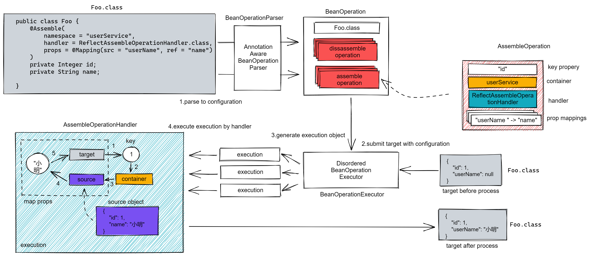

## 执行流程

`crane4j` 的整体执行流程并不复杂，可大致分为两阶段：

- 配置解析阶段：根据 `AnnotatedElement` （一般是类或者方法）解析获得对应的操作配置对象 `BeanOperation`，通过该配置对象我们可以知道一个对象中有多少个字段需要处理，要怎么处理，在 `BeanOperation` 里面，一个 `key` 字段对应的一个操作会被转为一个 `Operation` 对象；
- 操作执行阶段：输入要处理的对象，与该对象类型对应操作配置，然后交由操作执行器 `BeanOperationExecutor` 生成待完成的任务 `Execution`，并最终分发给操作执行器 `OperationHandler`，`OperationHandler` 会根据配置从数据源获得对象，并完成具体的字段映射；

比如上图，即描述了 `Foo` 对象是如何通过 `id` 获得数据源，并将数据源中的 `userName` 字段值映射到 `Foo` 的 `name` 字段上的。

## 操作配置 & 配置解析器

在 `crane4j` 中，操作是任务的最小单位，它分为两类：

- **装配操作** ：对应接口为 `AssembleOperation`，即“把xx塞到xx”这样的行为，“根据 A 的 key 值拿到 B，再把 B 的属性映射到 A” 这句话描述的就是一次装配操作；
- **拆卸操作**：对应接口为 `DisassembleOperation`，即“把xx从xx中拿出来”这样的行为，当存在需要处理的嵌套对象时，我们需要先把嵌套对象取出并展开，则就是一次拆卸操作；

它们有一个共同的特点，就是需要绑定在某个特定属性上，比如装配操作就需要绑定一个外键的字段，而拆卸操作需要绑定装有嵌套对象的字段，它们都称为 **key 字段**。

我们的一个对象——通常也对应一个 `Class` ——里面往往会有多个 key 字段，比如我有一个 `Classroom` 对象：

~~~java
public class Classroom {
    private Integer id;
    private String name;
    private Teacher teacher;
    private List<Student> Student;
}

public class Student {
    private id;
    private name;
}
~~~

我们可能只有一个 id，而需要根据 `id` 查到并填充它的 `name`、`teacher` 属性，并且还要根据它内部携带的 `Student` 的 `id` 填充对应的 `name` 字段集合，在这种情况下，一个 `Classroom` 类将会绑定三个操作：

- 根据 `Classroom.id` 填充 `Classroom.name` 的装配操作；
- 根据 `Classroom.id` 填充 `Classroom.teacher` 的装配操作；
- 将 `Classroom.student` 展开的拆卸操作；

为了便于管理，每个 `Class` 都会缓存一个操作配置聚合，即**类的操作配置** `BeanOperations`，里面记录这个类的所有装配操作和拆卸操作，而集中提供读取 `Class` 并且生成操作配置的类，就是**配置解析器** `BeanOperationsParser`，其中每一个配置注解（比如 `@Assemble`）都会有对应的**注解解析器** `OperationAnnotationResolver` 。

而被处理的对象 `Classroom` 就是**待处理对象**，而从容器中根据 `id` 得到的 `Classroom` 对象，就是**数据源对象**。

:::tip

将操作注解配置在 `Class` 以及 `Field` 上是最常见的，不过实际上 `crane4j` 支持从任何 `AnnotatedElement` 上解析注解并生成配置对象，这意味着如果有必要你也可以把配置配置在方法甚至方法参数上，比如执行操作一章中提到的执行者接口。

:::

## 操作处理器 & 操作执行器

现在我们通过 `Class` 可以得到待执行的装配操作和拆卸操作配置，然而最终还是需要有一个处理器，去真正的根据配置完成对应的属性读写，此即为操作处理器，其中装配操作由**装配操作处理器** `AssembleOperationHandler` 完成，而拆卸操作由**拆卸操作处理器** `DisassembleOperationHandler` 完成。

不过，因为操作间允许排序，因此有的操作需要先执行，有的操作需要后执行；并且由于拆卸操作的存在，虽然我们要填充的对象都是 A 类型的，但是通过拆卸操作最终可能拆出来一堆其他类型的对象，这些对象也会有拆卸操作，也会有需要排序的装配操作；为了提高效率，数据源相同的操作最好放在一起完成以便减少获取数据源的次数......

总而言之，我们需要有一个组件，可以尽可能高效而清晰的将操作归类分组，并变成一个批量任务，最终再交由对应的操作处理器完成，这个组件就是**操作执行器** `BeanOperationsExecutor`，而批量任务即为**执行对象** `AssembleExecution`。

## 数据源容器 & 属性映射

每个装配操作必然具备三个基本要素：

- **key 字段**：即用于关联填充数据的外键字段；
- **数据源容器**：即根据 key 字段值用于获取填充数据的组件；
- **属性映射**：获取到 key 字段值对应的数据源对象后，要把它的哪些属性值塞到自己的哪些属性值里；

只要操作处理器支持，数据源容器可以接受，则 key 字段的类型可以是常规的 id 值，或者用分隔符拼接成的 id 字符串，甚至是集合。而属性映射也是同理，只要操作处理器支持，填充的对象和数据源对象的类型是个普通的 JavaBean，还是枚举，甚至是 Map 集合或者数组都行。

数据源容器本身也可以是任何实现了 `Container` 接口的东西，它可以是一个简陋的 Map 集合，一段可以调用的方法，甚至是固定的常量，能接受输入 key 值并且返回按 key 值分组的数据的东西都可以作为数据源容器。

## 设计原则

`crane4j` 在设计的时候，遵循两个原则：

- 对于 api，希望能够尽可能的符合直觉，即用户觉得这样做应该会有这样的效果，那么它就应该是这样的效果；
- 对于代码，则希望每个类尽可能做到单一职责，然后再通过细粒度组件的复用与组合来实现功能；

实际上某种程度上来说，后者是前者的基础，因为有了灵活的细粒度组件，所以我们才可以通过多种方式去组合出我们所需要的功能。这种编码风格，提升了代码的可读性、可测性和可扩展性，不过作为代价，`crane4j` 实现某个功能可能需要比较多的类来完成，这导致在缺少类似 spring 这类的 IOC 容器时使用起来会比较爪麻，以及更多的对象所带来的一些内存占用，不过相对收获来说还是很划算的。

作者希望用户使用默认的配置能够用的舒心，但是若有必要也能通过最小范的调整适配自己的逻辑，
