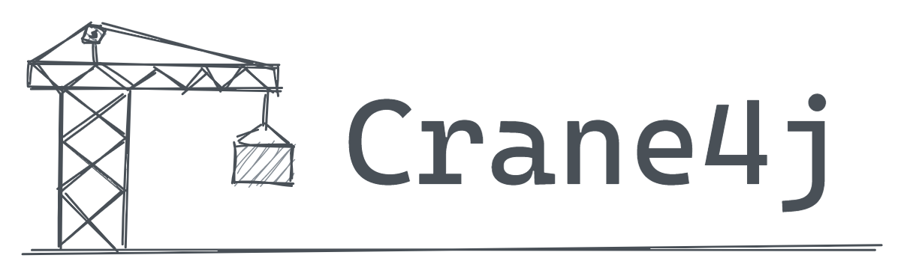

# 什么是 cranej4？

**crane4j 是一个基于注解的，用于完成一切 “根据 A 的 key 值拿到 B，再把 B 的属性映射到 A” 这类需求的字段填充框架。**

最初，我在公司开发中遇到了大量重复的字段填充需求，这些需求与核心业务无关，只是一些重复的关联查询操作。我厌倦了频繁的联查和手动赋值，于是花了时间写一个小插件，用于自动查询接口并填充字段值。

随着时间推移，这个插件功能逐渐丰富，我还加入了对枚举和常量的转换支持，并实现了基于切面的自动填充功能。最终，这个插件发展成了一个独立的内部框架，并在生产环境中广泛使用。

在 2022 年初，我对这个内部框架进行了重构，并将其上传到 `Gitee`，它就是 [`crane`](https://github.com/Createsequence/crane)。经过半年多的更新，`crane` 的功能逐渐稳定，但早期设计的不足导致扩展困难。因此，我重新梳理了功能，并决定在保留 `crane` 功能和概念的基础上进行彻底的重构，这就是现在的 `crane4j`。

## 1.什么是字段填充？

在日常开发中，我们不能指望直接从缓存或 DB 中查到的数据直接具备所有前端需要的字段，因此我们往往需要通过外键从各种数据源中 —— 比如 RPC 接口、枚举、字典或者 DB —— **根据外检查询出各种关联信息**，并将其部分字段填充到接口最终返回的对象上，这种行为实际上就是字段填充**，或者也可以叫做数据组装或者数据聚合。

我们以一个典型的“将字典编码转为字典值”为例：

~~~java
public List<Person> listPerson(List<Integer> ids) {
    // 1、根据 id 查询 person 数据
    List<Preson> persions = personMapper.listByIds(ids);
    
    // 2、将性别枚举按编码分组
    // {key = 0, value = GenderEnum.FEMALE}, {key = 1, value = GenderEnum.MALE}
    Map<Integer, GenderEnum> genderMap = Stream.of(GenderEnum.values())
        .collect(Collectors.toMap(GenderEnum::getCode, e -> e));

    // 3、根据 person 对象中的性别编码，为其设置对应的性别值
    persions.forEach(person -> {
        Integer genderCode = person.getGenderCode();
        GenderEnum gender = genderMap.get(genderCode);
        person.setGenderName(gender.getName());
    })
}
~~~

`listPerson` 接口中的第 2、3 步就是非常典型的数据填充操作。

## 2.用 crane4j 怎么做？

当引入 crane4j 后，我们可以通过相对简洁的注解描述上述操作，并将其从主业务流程中剥离，以便让开发者更加集中于核心业务逻辑的开发：

~~~java
@AutoOperate
public List<Person> listPerson(List<Integer> ids) {
    return personMapper.listByIds(ids);
}

@Data
public class Person {
    @AssembleEnum(
        type = GenderEnum.class, enumKey = "code", // 指定枚举类，并按字典值分组
        props = @Mapping(src = "name", ref = "genderName") // 将枚举的 name 映射到 foo 的 genderName 属性
    )
    private Integer genderCode;
    private String genderName;
}
~~~

等到方法调用后，crane4j 将会自动的完成填充，效果与执行之前的代码完全一致。

## 3.为什么需要 crane4j？

**字段填充是一个广泛存在的需求，而 crane4j 则是针对它的一套完善的解决方案。**

crane4j 有着详细的注释和文档，完善的测试用例，灵活而直观的 API，通过引入 crane4j，你可以在避免“重复造轮子”的前提下，通过更少的代码搞定各种数据填充的需求。并且，你还可以通过 crane4j 处理比示例更复杂的各种情况，包括且不限于下述场景：

+ **同时存在的复数操作**：可能同时有多种类型的数据需要填充，比如各种详情页中，我们可能需要填充大量的关联数据；
+ **复杂的数据结构**：填充的对象可能是一个嵌套的树形结构，需要递归的填充嵌套的数据；
+ **繁多的数据源**：填充的数据源可能多种多样，比如有的通过 RPC 接口获取，有的通过 ORM 框架获取，有的则从本地缓存中获取；
+ **可选的字段填充**：相同的数据源在不同的场景下填充的字段可能不同，比如同样是用户查询接口，当对外展示时则需要屏蔽一些敏感信息，比如身份证号、权限等级等等；
+ **异步填充**：出于效率考虑，在数据源需要通过频繁的网络 IO 查询时，我们可能会希望异步的完成数据填充；

你所面临的场景越多样化，那么 cranej4 就可能能够带给你越多的便利。

## 4、如何开始使用？

如果你是第一次接触此类框架的新用户，那么推荐你先阅读 “**基本概念**” 建立对框架的初步认知，然后跟着 “**快速开始**” 一节尝试在本地编写一个可运行的最小示例，最后再根据情况继续阅读 “**场景示例**” 或其他内容。

如果你已经使用过类似的框架，你可以直接阅读 “**快速开始**”，然后根据需要阅读后续的 “**场景示例**” 即可。
